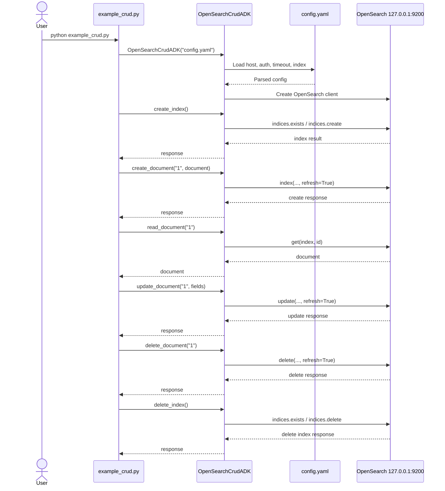

# OpenSearch CRUD Python 예제 (YAML 설정 + ADK)

이 예제는 `127.0.0.1` OpenSearch를 대상으로, YAML 설정 파일을 읽는 Python ADK(Application/Data Kit) 클래스를 만들고 CRUD를 수행합니다.

## 파일 구성

- `config.yaml`: OpenSearch 접속 정보 및 인덱스명
- `opensearch_adk.py`: OpenSearch CRUD ADK 구현
- `opensearch_sdk.py`: 기존 SDK 이름으로도 import할 수 있는 호환 alias
- `example_crud.py`: ADK 사용 예제
- `requirements.txt`: 의존성

## 1) 설치

```bash
python -m venv .venv
source .venv/bin/activate
pip install -r requirements.txt
```

## 2) OpenSearch 실행 확인

기본 설정은 아래와 같습니다.

- Host: `127.0.0.1`
- Port: `9200`
- ID/PW: `admin/admin`
- Index: `sample-products`

필요하면 `config.yaml` 값을 수정하세요.

## 3) 실행

```bash
python example_crud.py
```

## CRUD 메서드

`OpenSearchCrudADK`에 아래 메서드가 구현되어 있습니다.

- `create_index(mapping=None)`
- `create_document(doc_id, document)`
- `read_document(doc_id)`
- `update_document(doc_id, fields)`
- `delete_document(doc_id)`
- `delete_index()`

## Sequence Diagram


